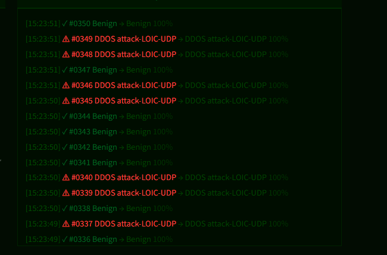
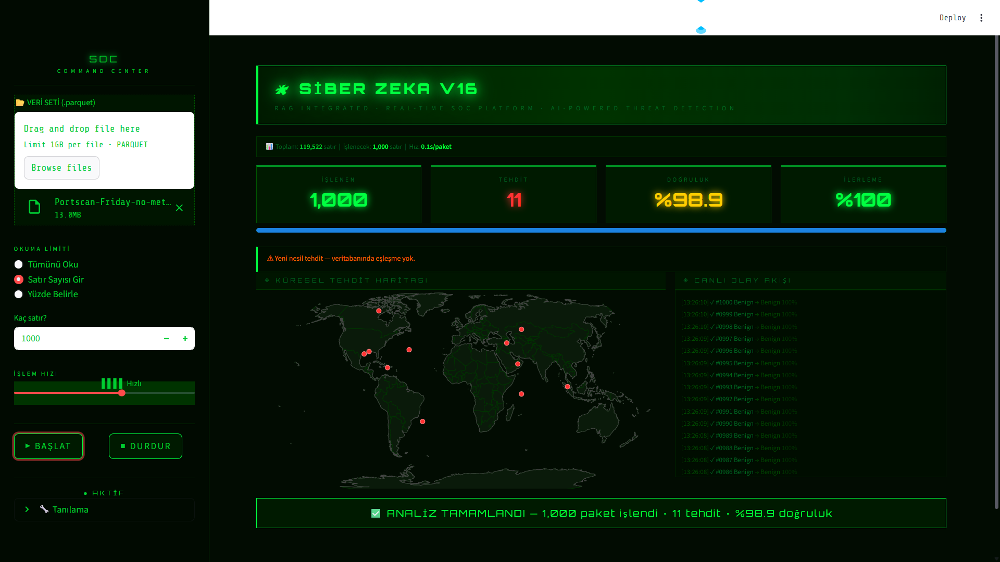
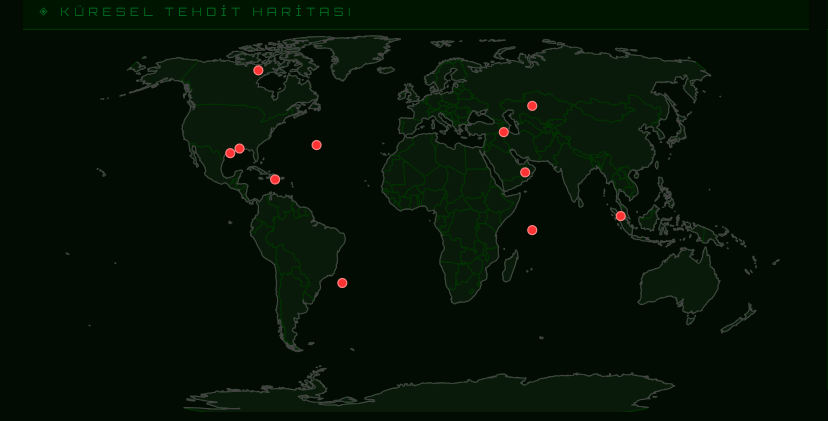

# Real-Time Cyber Threat Detection System

## Overview

This project is an AI-powered cybersecurity monitoring system designed to detect suspicious network activities in real time using machine learning techniques.

The system analyzes network traffic, predicts attack types, stores logs in a SQLite database, and visualizes results through an interactive Streamlit dashboard.

---

## Features

- Real-time cyber attack detection
- Machine learning-based predictions
- Interactive Streamlit dashboard
- SQLite database integration
- Threat logging and monitoring
- Live attack visualization

---
## Dashboard Preview









## Technologies Used

- Python
- Streamlit
- Pandas
- NumPy
- Scikit-learn
- SQLite
- Plotly
- Joblib

---

## Installation

Clone the repository:

```bash
git clone https://github.com/abdulkadiraydogmus982-ops/real-time-cyber-threat-detection.git
```

Install dependencies:

```bash
pip install -r requirements.txt
```

Run the project:

```bash
streamlit run app.py
```

---

## Project Structure

```text
project/
│
├── app.py
├── README.md
├── .gitignore
```

---

## Future Improvements

- Real-time packet sniffing
- Deep learning integration
- Advanced threat intelligence
- Web deployment
- User authentication system

---

## Author

Abdulkadir Aydogmus

Cybersecurity & Data Analysis 
